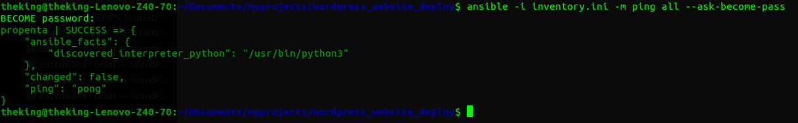
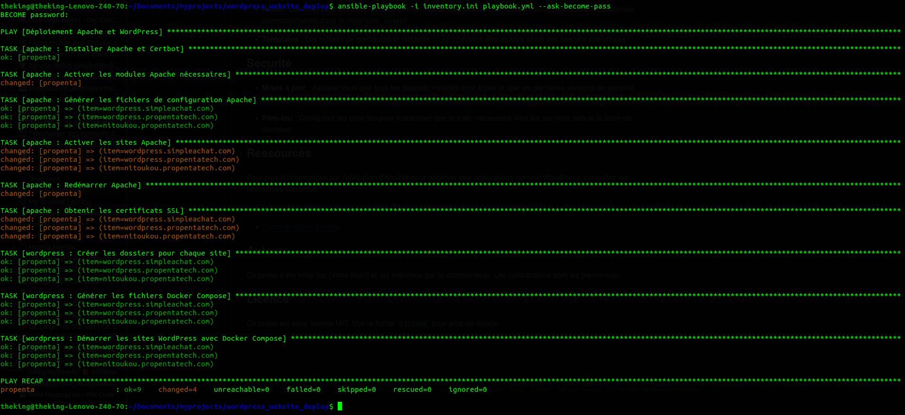

# Déploiement Automatisé de Sites WordPress avec Ansible

Ce projet fournit une configuration Ansible permettant de déployer automatiquement des sites WordPress sur des serveurs distants. Il automatise l'installation du serveur web, de la base de données, de PHP et de WordPress lui-même.

## Prérequis

- **Ansible** : Assurez-vous que Ansible est installé sur votre machine de contrôle. Si ce n'est pas le cas, vous pouvez l'installer en suivant les instructions officielles d'Ansible.

- **Accès SSH** : Les serveurs cibles doivent être accessibles via SSH avec les permissions appropriées pour permettre à Ansible d'exécuter les tâches nécessaires.

- **Docker** : Docker doit être installé sur la machine distante. Si ce n'est pas le cas, vous pouvez l'installer en suivant les instructions officielles [ici](https://docs.docker.com/engine/install/).
  
- **Docker Compose** : Docker Compose est également requis pour orchestrer les conteneurs WordPress, MySQL et PHPMyAdmin. Installez-le en suivant les instructions [ici](https://docs.docker.com/compose/install/).


## Structure du Projet

La structure du projet est organisée comme suit :
```
wordpress_website_deploy/ 
.
├── docker-compose.yml
├── Dockerfile
├── encrypt.py
├── inventory.ini
├── playbook.yml
├── README.md
└── roles
    ├── apache
    │   ├── defaults
    │   │   └── main.yml
    │   ├── files
    │   ├── handlers
    │   │   └── main.yml
    │   ├── meta
    │   │   └── main.yml
    │   ├── README.md
    │   ├── tasks
    │   │   └── main.yml
    │   ├── templates
    │   │   └── wordpress.conf.j2
    │   ├── tests
    │   │   ├── inventory
    │   │   └── test.yml
    │   └── vars
    │       └── main.yml
    ├── delete-all
    │   ├── defaults
    │   │   └── main.yml
    │   ├── files
    │   ├── handlers
    │   │   └── main.yml
    │   ├── meta
    │   │   └── main.yml
    │   ├── README.md
    │   ├── tasks
    │   │   └── main.yml
    │   ├── templates
    │   ├── tests
    │   │   ├── inventory
    │   │   └── test.yml
    │   └── vars
    │       └── main.yml
    └── wordpress
        ├── defaults
        │   └── main.yml
        ├── files
        ├── handlers
        │   └── main.yml
        ├── meta
        │   └── main.yml
        ├── README.md
        ├── tasks
        │   └── main.yml
        ├── templates
        │   └── docker-compose-wordpress.yml.j2
        ├── tests
        │   ├── inventory
        │   └── test.yml
        └── vars
            └── main.yml

28 directories, 32 files
```


- `ansible.cfg` : Fichier de configuration d'Ansible.
- `inventory.ini` : Fichier d'inventaire listant les serveurs cibles.
- `playbook.yml` : Playbook principal orchestrant le déploiement.
- `roles/` : Répertoire contenant les rôles apache pour la configuration des proxi, puis securisation du nom de domaine et worPress pour le deploimenet propement dit , sans toutes fois oublier le role delete-all pour supprimer toutes les ressources cree sur le server , a manipuler avec la plus grande attention possible .

## Configuration

1. **Fichier d'inventaire (`inventory.ini`)** : Listez le serveur cibles où les sites WordPress doivent être déployé. Par exemple :

    ```
    [webserver]
    propenta ansible_host= ip_du_server_de_deploiment   ansible_user= nom_utilisateur_connection_ssh ansible_ssh_private_key_file=lien_vers_la_cle_privee_ssh  ansible_become=True
    propenta ansible_host=185.218.126.7 ansible_user=roberto ansible_ssh_private_key_file=~/.ssh/id_rsa ansible_become=True

    ; ... effacer et ajouter les parametres de connection a votre server.
    ```

2. **Fichier de Playbook (`playbook.yml`)** : Définissez les noms de domaines pour vos deploiments .

    ```
    - name: Déploiement Apache et WordPress
      hosts: webserver
      become: yes
      become_method: sudo
      gather_facts: no
    
      vars:
        wordpress_sites:
          - wordpress.simpleachat.com
          - wordpress.propentatech.com 
          # ajouter tout les autres noms de domaines ici
          
      roles:
        - apache
        - wordpress 
    
    # decomenter la ligne du dessous si vous souhaitez supprimer toutes les ressources cree jusqu'au dossiers 
        # - delete-all
    
    ```
- si vous souhaitez supprimer toutes les ressources crees , decommentez la ligne delete-all
   

## Utilisation

1. Clonez ce dépôt sur votre machine de contrôle :

    ```bash
    git clone https://github.com/ngueagho/wordpress_website_deploy.git
    cd wordpress_website_deploy
    ```

2. Vérifiez la connectivité avec les serveurs cibles :

    ```bash
    ansible -i inventory.ini -m ping all 
    ```
   

3. Exécutez le playbook pour déployer WordPress :

    ```bash
    ansible-playbook -i inventory.ini playbook.yml
    ```
    - faite le uniquement si l'etape precedente a marque success
       


## Personnalisation

- **Rôles** : Les rôles pour Apache , WordPress et delete-all peuvent être personnalisés en modifiant les tâches correspondantes dans le répertoire `roles/`.

- **Templates** : Les fichiers de configuration modèles (`.j2`) peuvent être ajustés selon vos besoins spécifiques.

## Sécurité

- **Mises à jour** : Assurez-vous que tous les paquets installés sont à jour et que les dernières versions de sécurité sont appliquées.

- **Pare-feu** : Configurez les pare-feu pour n'autoriser que le trafic nécessaire vers les services web et la base de données.

## Ressources

Pour plus d'informations sur l'utilisation d'Ansible pour déployer des applications comme WordPress, consultez les ressources suivantes :

- [Automatiser l'installation et la configuration de WordPress avec Ansible](https://www.digitalocean.com/community/tutorials/how-to-use-ansible-to-install-and-set-up-wordpress-with-lamp-on-ubuntu-18-04-fr)

- [Documentation Ansible](https://docs.ansible.com/ansible/latest/index.html)

## Auteurs

Ce projet a été initié par [TIODONG ROBERTO LANDRY] et est maintenu par la communauté. Les contributions sont les bienvenues.

## Licence

Ce projet est sous licence MIT. Voir le fichier `LICENSE` pour plus de détails.
